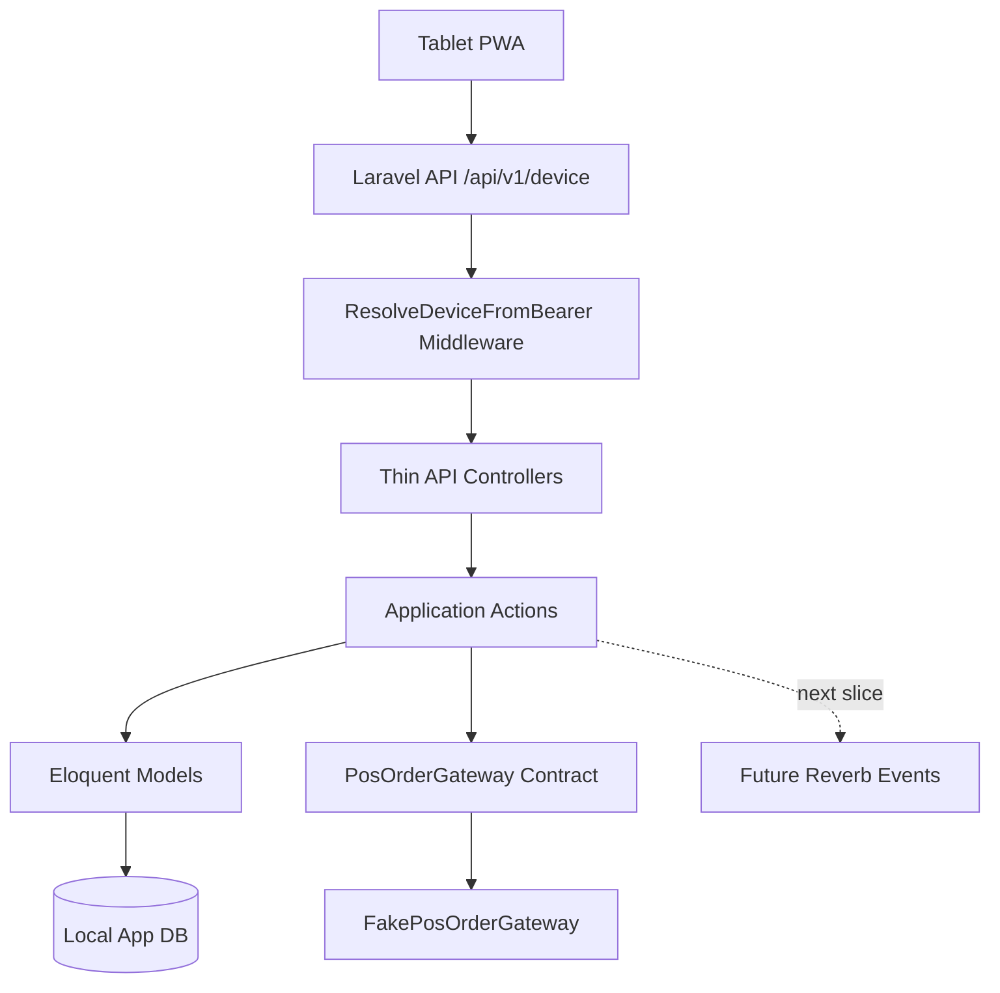
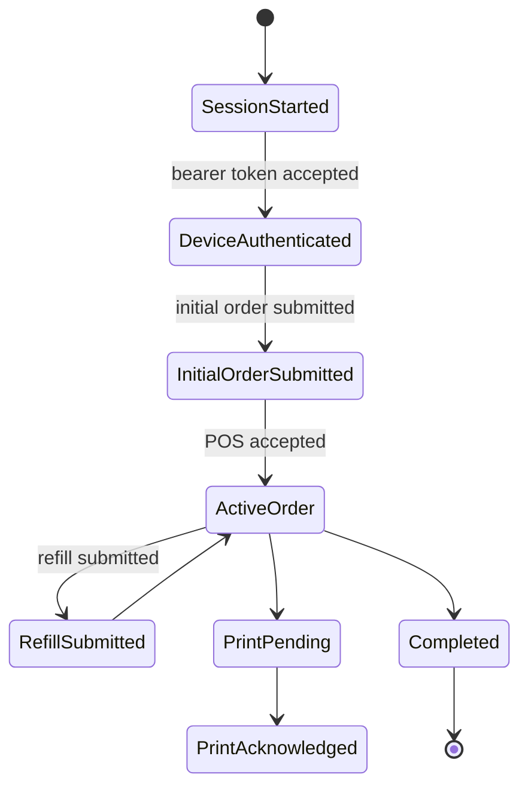

# CASE FILE: Woosoo App MVP Ordering Backend

## Objective
Implement the backend ordering core for `woosoo-app` using Laravel 13.

## Repository Boundary
This case is scoped to `woosoo-app` only.

Do not modify:

- `woosoo-grillpad`
- `woosoo-nexus`
- `woosoo-print-bridge`

## Architecture Map

## Implemented Backend Surface

- Device session start and restore
- Bearer-token device middleware
- Initial order creation from resolved device context
- Active order lookup from resolved device context
- Refill order submission scoped to the resolved device
- Print event listing scoped to the resolved device
- Print event acknowledgement scoped to the resolved device

## State Machine

## Security Notes

- Device tokens are returned only once during session start.
- Device tokens are stored as SHA-256 hashes.
- Protected device endpoints now resolve the device from `Authorization: Bearer <token>`.
- Order creation and active-order lookup no longer trust request-level `device_id`.
- Refill and print-event operations verify ownership against the resolved device context.
- Broadcast payloads must not expose device tokens.
- POS gateway failures must not leak raw stored procedure details to clients.

## Race Condition Notes

- Duplicate active order creation is guarded by resolved `device_id + session_key` inside a database transaction.
- The active-order check uses `lockForUpdate()` when the database driver supports row-level locking.
- Reverb event dispatch is intentionally deferred to the next slice so it can be implemented with after-commit semantics.

## Audit Checklist

- [x] Race conditions / async leaks considered
- [x] State machine / contract integrity considered
- [x] Security / auth boundary upgraded with bearer-token device middleware
- [x] Cross-device refill and print-event access blocked
- [x] Monorepo / shared config drift avoided
- [x] Test sufficiency seeded with feature tests

## Known Follow-ups

1. Run the full local test/lint suite on `feat/device-token-middleware`.
2. Add real Krypton POS stored-procedure gateway implementation.
3. Dispatch Reverb events after commit for order and print state changes.
4. Add admin endpoints only after device flow is stable.
