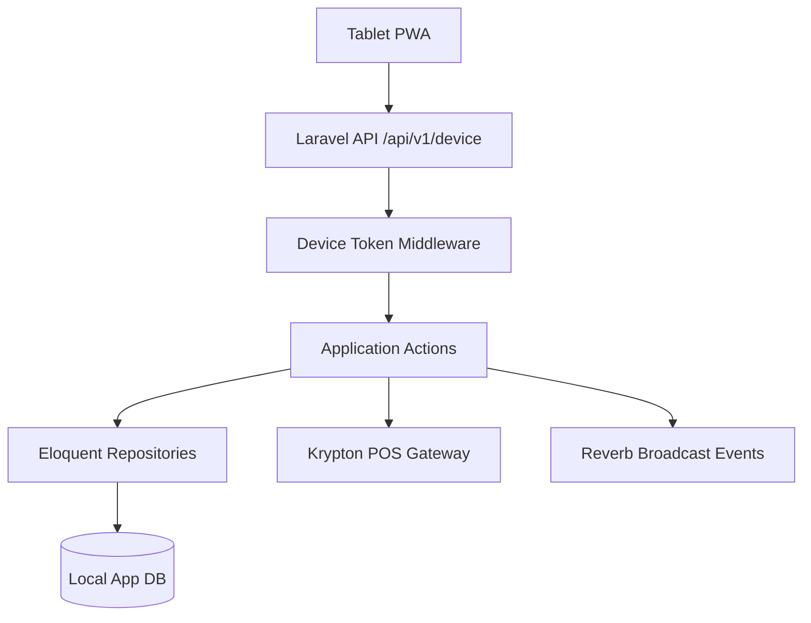
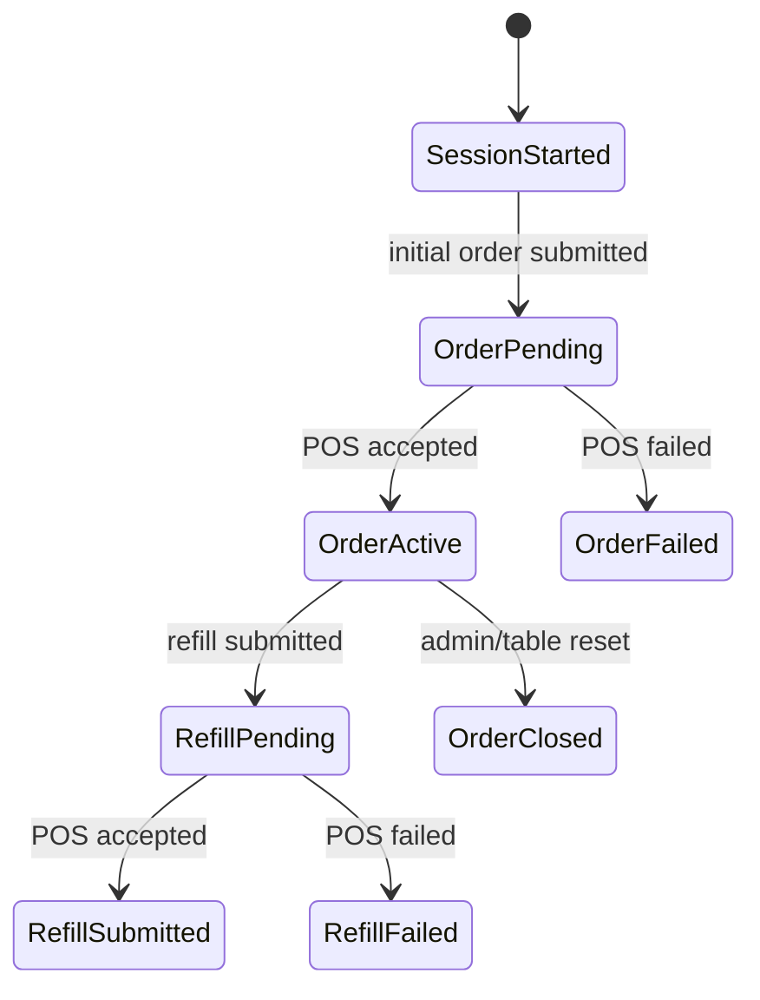

# CASE FILE: Woosoo App MVP Ordering Backend

## Objective
Implement the backend ordering core for `woosoo-app` using Laravel 13.

## Repository Boundary
This case is scoped to `woosoo-app` only.

Do not modify:

- `woosoo-grillpad`
- `woosoo-nexus`
- `woosoo-print-bridge`

## Architecture Map

## State Machine

## Audit Checklist

- [x] Race conditions / async leaks considered
- [x] State machine / contract integrity considered
- [x] Security / auth boundaries considered
- [x] Monorepo / shared config drift considered
- [x] Test sufficiency seeded

## Security Notes

- Device tokens are returned only once during session start.
- Device tokens are stored as SHA-256 hashes.
- Broadcast payloads must not expose device tokens.
- POS gateway failures must not leak raw stored procedure details to clients.

## Race Condition Notes

- Active order creation checks for existing pending or active initial orders.
- Device row is locked during initial order creation when supported by the database driver.
- Reverb events are dispatched only after local DB commit.
