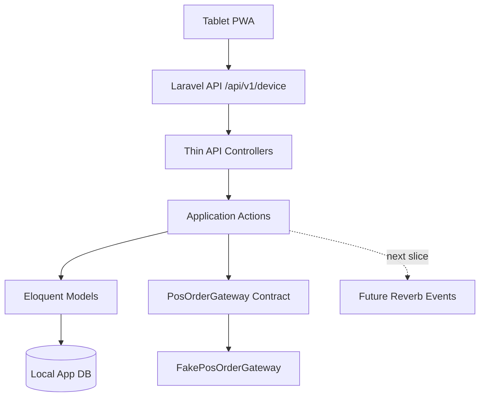
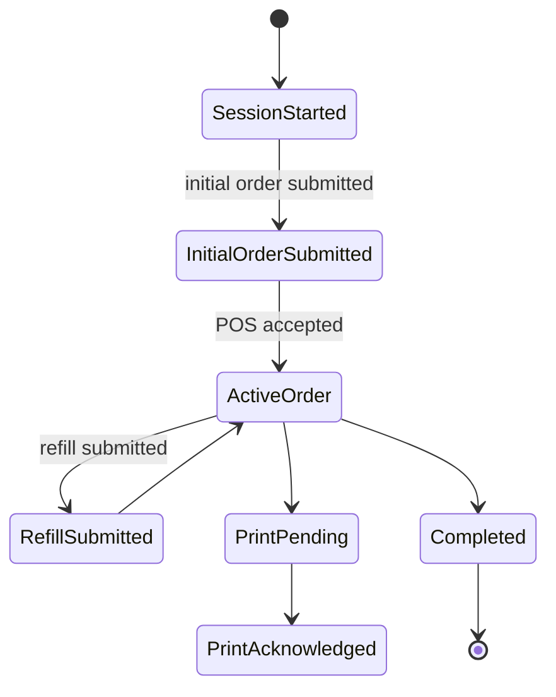

# CASE FILE: Woosoo App MVP Ordering Backend

## Objective
Implement the backend ordering core for `woosoo-app` using Laravel 13.

## Repository Boundary
This case is scoped to `woosoo-app` only.

Do not modify:

- `woosoo-grillpad`
- `woosoo-nexus`
- `woosoo-print-bridge`

## Architecture Map

## Implemented Backend Surface

- Device session start and restore
- Initial order creation
- Active order lookup
- Refill order submission
- Print event listing
- Print event acknowledgement

## State Machine

## Security Notes

- Device tokens are returned only once during session start.
- Device tokens are stored as SHA-256 hashes.
- Broadcast payloads must not expose device tokens.
- POS gateway failures must not leak raw stored procedure details to clients.
- MVP order endpoints currently accept `device_id` directly. This is a development-only bridge and must be replaced with bearer-token device context before production exposure.

## Race Condition Notes

- Duplicate active order creation is guarded by `device_id + session_key` inside a database transaction.
- The active-order check uses `lockForUpdate()` when the database driver supports row-level locking.
- Reverb event dispatch is intentionally deferred to the next slice so it can be implemented with after-commit semantics.

## Audit Checklist

- [x] Race conditions / async leaks considered
- [x] State machine / contract integrity considered
- [ ] Security / auth boundary still needs bearer-token device guard before production
- [x] Monorepo / shared config drift avoided
- [x] Test sufficiency seeded with feature tests

## Known Follow-ups

1. Replace request-level `device_id` trust with token-authenticated device context.
2. Add real Krypton POS stored-procedure gateway implementation.
3. Dispatch Reverb events after commit for order and print state changes.
4. Add admin endpoints only after device flow is stable.
5. Run the full local test/lint suite in a checked-out environment.
