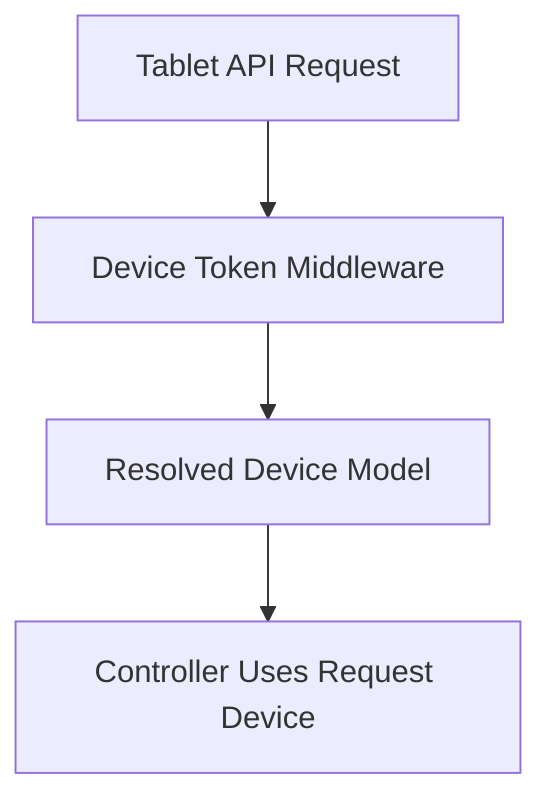

# HANDOVER PROTOCOL: MVP Ordering Backend Core

## Current Status
The first backend-only development slice has been implemented in `woosoo-app`.

## Completed

- Registered `routes/api.php` in Laravel bootstrap.
- Added MVP device API routes under `/api/v1/device`.
- Added migrations for:
  - `devices`
  - `device_orders`
  - `device_order_items`
  - `print_events`
- Added Eloquent models and relationships.
- Added `PosOrderGateway` contract.
- Added `FakePosOrderGateway` for safe local/dev testing.
- Bound the POS gateway contract in `AppServiceProvider`.
- Added actions for:
  - initial order creation
  - active order lookup
  - refill order submission
  - print event acknowledgement
- Added request validation and JSON resources.
- Added feature tests for the MVP API flow.
- Updated `docs/CASE_FILE.md`.

## Validation Commands
Run locally after pulling latest `main`:

```bash
composer install
php artisan migrate:fresh --env=testing
php artisan test tests/Feature/DeviceOrderingApiTest.php
composer test
```

## API Contract Implemented

```http
POST /api/v1/device/session/start
POST /api/v1/device/session/restore
GET  /api/v1/device/orders/active
POST /api/v1/device/orders
POST /api/v1/device/orders/{order}/refills
GET  /api/v1/device/print-events
POST /api/v1/device/print-events/{printEvent}/ack
```

## Important Risks

1. `device_id` is currently accepted from request payload/query for MVP speed. Replace with token-authenticated device context before production.
2. `FakePosOrderGateway` must be replaced or conditionally configured before real POS integration.
3. Reverb events are not yet implemented. Add after-commit broadcasting in the next backend slice.
4. Admin routes are not implemented yet.
5. Tests were added but not executed by the connector environment.

## Next Slice Recommendation

Implement device bearer-token middleware:



Then remove direct `device_id` trust from order and active-order endpoints.

## Handover Rule
Do not begin frontend integration until backend API payloads are verified locally with feature tests or manual API calls.
