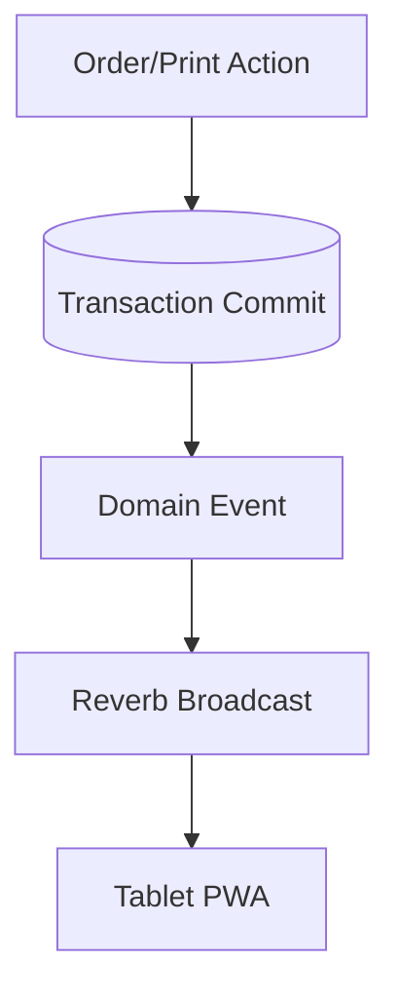

# HANDOVER PROTOCOL: Device Bearer Middleware Slice

## Current Status
The `feat/device-token-middleware` backend slice upgrades the MVP device API from request-level `device_id` trust to bearer-token device context.

## Completed

- Added `ResolveDeviceFromBearer` middleware.
- Registered the middleware alias as `device` in `bootstrap/app.php`.
- Protected order/refill/print routes behind the `device` middleware.
- Kept session start and restore public.
- Removed `device_id` from initial order validation.
- Updated `DeviceOrderController` to resolve the device from request attributes.
- Scoped refill submission to the resolved device owner.
- Scoped print event listing and acknowledgement to the resolved device owner.
- Updated feature tests to use `Authorization: Bearer <token>`.
- Added tests for missing bearer credentials.
- Added tests for cross-device refill and print acknowledgement blocking.
- Updated `docs/CASE_FILE.md`.

## Validation Commands
Run locally after checking out the branch:

```bash
composer install
php artisan migrate:fresh --env=testing
php artisan test tests/Feature/DeviceOrderingApiTest.php
composer test
```

## API Auth Contract

Public endpoints:

```http
POST /api/v1/device/session/start
POST /api/v1/device/session/restore
```

Protected endpoints require:

```http
Authorization: Bearer <64-character-device-token>
```

Protected endpoints:

```http
GET  /api/v1/device/orders/active
POST /api/v1/device/orders
POST /api/v1/device/orders/{order}/refills
GET  /api/v1/device/print-events
POST /api/v1/device/print-events/{printEvent}/ack
```

## Important Risks

1. Tests were updated through the connector but still need a local `composer test` run on this branch.
2. `FakePosOrderGateway` remains intentionally active for test/dev.
3. Reverb events are not yet implemented. Add after-commit broadcasting in the next backend slice.
4. Admin routes are not implemented yet.

## Next Slice Recommendation

Add after-commit Reverb events:



## Handover Rule
Do not begin frontend integration until this branch is validated locally and merged.
